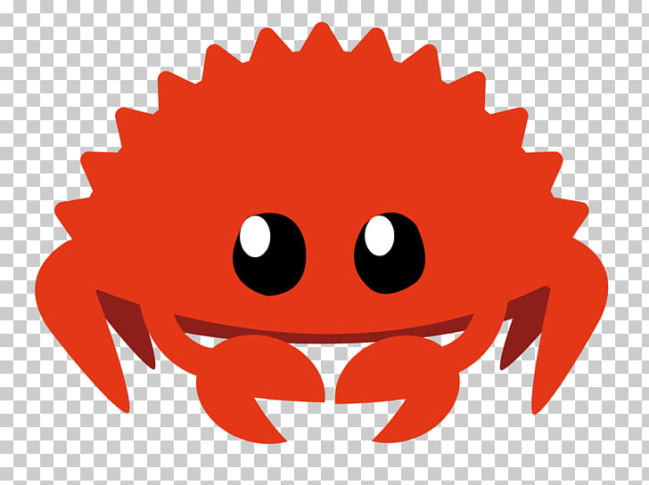

# learn-rust

## What is this?

This is a collection of projects made to help me learn the Rust programming langauge. It is a companion to https://doc.rust-lang.org/stable/book/.

## Why make this?

Because I want speed and generics and modernity.

## How do I contribute?

- Make a new project.
	- `cd projects/<project-num> && cargo new --vcs=none <project-name>`

## How do I use this?

- Have Rust installed (https://doc.rust-lang.org/book/ch01-01-installation.html)
- Navigate to a project(`cd <dir-of-interest>`)
- Read the code (Pre-Req: reading you are doing it right now)
- Run the code (`rustc <file> || cargo run`)

## Resources

- https://doc.rust-lang.org/stable/book/
- https://doc.rust-lang.org/cargo/
